<picture>
  
</picture>

<br>

# Yang Huixiang

**Software engineer building AI systems, developer tools, and durable infrastructure.**

I turn ambiguous product ideas into working software, then follow the real logs, data flow, and runtime behavior until the result is reliable.

专注于 AI Agent、RAG、开发工具、桌面应用与服务基础设施。

[Personal website](https://yanghuixiang.cn) | [GitHub repositories](https://github.com/huixiangyang?tab=repositories)

## Live engineering signal

<a href="https://github.com/huixiangyang/huixiangyang/actions/workflows/profile-signal.yml">
  
</a>

<sub>Generated daily from public GitHub events by this profile repository.</sub>

<details>
<summary><strong>Open the observatory console</strong></summary>

```text
operator@github:~$ ./inspect --human

identity    software engineer
bias        working software over convincing slides
protocol    observe -> trace -> fix -> verify
signal      calm interface / rigorous system
```

</details>

## Current focus

- Agent orchestration, retrieval systems, evaluation, and observable AI workflows
- TypeScript and Rust applications with practical desktop and web delivery
- Go, Python, and Java services built around explicit contracts and real operational evidence
- Cloudflare, containers, networking, and maintainable deployment automation

## Working stack

<p>
  
  &nbsp;&nbsp;
  
  &nbsp;&nbsp;
  
  &nbsp;&nbsp;
  
  &nbsp;&nbsp;
  
  &nbsp;&nbsp;
  
  &nbsp;&nbsp;
  
  &nbsp;&nbsp;
  
  &nbsp;&nbsp;
  
  &nbsp;&nbsp;
  
</p>

## Engineering principles

1. Start from the real entry point and trace the complete data path.
2. Prefer clear contracts, small components, and observable runtime behavior.
3. Treat documentation and verification as part of the implementation.
4. Keep the interface calm even when the system behind it is complex.

<br>

<sub>Open to thoughtful conversations about AI engineering, developer experience, and practical infrastructure.</sub>
